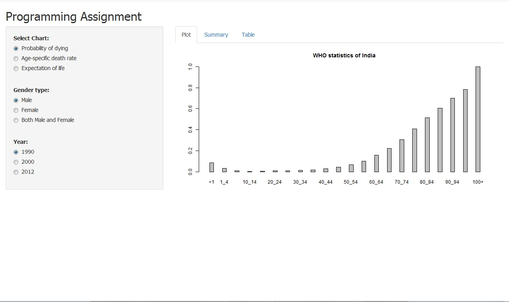

 
 
<h3>Mortality statistics of India</h3>

 
<h5>based on Data collected from <b> WHO </b> </h5>   
keen23   
Programming Assignment

--- .class #id 

## About Programming Assignment

 
1. This assignment has been created for the Developing Data Products course, a part of <b>Data Science</b> Specialization by <b>Johns Hopkins Bloomberg School of Public Health</b>. 
  
2.The  Programming Assignment has been done in shiny  and the this slidify presentation is regarding the same app.

--- .class #id 

## About The App 

 
1. Analysis has been done on data collected about  mortality rate and life expectancy in India  from  WHO  website.  
2. This application has some filters in the <b> side panel</b> and the results are displayed in the <b> Main Panel </b>.    
3. The Main panel consists of 3 Tabs for  <b> Plot, Summary Statistics and the Table </b> for displying the data.

--- .class #id 

## About The App 

  
1. The data file for this app has also been uploaded as some cleaning has been done to generate the desired results.   
2. The data file should be in the same directory for application to correctly run. 

--- .class #id 

## Filtering Data
 

 Three filters have been provided for filtering the results
 
1. The very first filter is about the type of data user wants to view. There are 3 options in this:
 
    a. Probability of Dying  
    b. Age specific death rate  
    c. Expectation of life   
2. The second option is to filter the data based on the gender. 
3. This data is available for year <b> 1990, 2000 and 2012.</b> So, the third option is to filter the data for a specific year.

--- .class #id 

## Function used
 
1. Reactive function has been written that uses widget input and generates the output. 
2. The reactive function will update  the result whenever the original widget changes i.e. whenever user changes the input/filter values the output will be updates accordingly. 
3. This application has some filters in the side panel and the results are displayed in the Main Panel.

--- .class #id 

## Output

